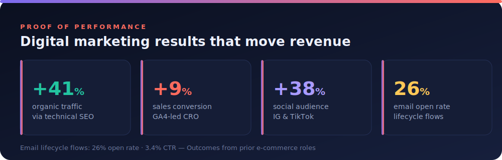

<h1 align="center">Hi, I'm Olamilekan 👋</h1>
<h3 align="center">Digital Marketing Executive · Paid Social · SEO · Email & Lifecycle · GA4 & CRO</h3>

  
  &nbsp;
  
  &nbsp;
  

  

---

### 👤 About me

Data-driven **Digital Marketing Executive** with **4+ years** scaling e-commerce brands through
cross-channel campaigns — **paid social, SEO, email, and conversion optimisation**. I turn marketing
budgets into measurable revenue: a consistent **4:1 return on ad spend**, **+45% organic traffic**,
and **+12% conversion** through analytics-led A/B testing.

- 🚀 Focused on profitable acquisition, audience growth, and retention
- 🎓 **MSc Digital Marketing (Merit)** — University of Roehampton
- 💬 Ask me about paid social, technical SEO, lifecycle email, and GA4-led CRO
- 📍 Based in **Peterborough, UK** — open to Digital Marketing roles
- 📫 **olamilekankdk@gmail.com**

---

### 🛠️ Channels & Tools

---

### 📈 Campaign Case Studies

> 🌐 **See the full visual portfolio → [olamilekankdk-sys.github.io](https://olamilekankdk-sys.github.io/)**

| Campaign | What I delivered | Channels |
|----------|------------------|----------|
| **Scaling 3 e-commerce brands profitably** | Owned a £15k/mo budget across Google & Meta at a sustained **4:1 ROI**; rebuilt SEO for **+45% organic traffic**; GA4 checkout CRO for **+12% conversion**. | Google Ads · Meta · SEO · GA4 |
| **Lifecycle email & social growth** | Built welcome + abandoned-cart automations (**28% open / 6.5% CTR**) and a video-first content strategy that grew social following **+60%** and engagement **+35%**. | Email · HubSpot · TikTok · Instagram |
| **SEO content engine (B2B tech)** | Keyword-led content calendar and on-page SEO that pushed **8 keywords into the top 10**, plus paid LinkedIn campaign support. | SEO · SEMrush · WordPress · LinkedIn Ads |

---

### 📊 Analytics & Measurement

Marketing only counts if you can prove it. These repos show how I measure performance end-to-end:

| Project | What it does | Stack |
|---------|--------------|-------|
| **[📊 Marketing Performance Dashboard](https://github.com/olamilekankdk-sys/looker-studio-report)** | GA4 marketing dashboard — channel acquisition, landing pages, KPI scorecards, rolling 28-day trends. | Looker Studio · GA4 |
| **[🛒 E-commerce Analysis](https://github.com/olamilekankdk-sys/olist-marketing-analysis)** | SQL analysis of ~100k orders — sales, retention, payments, delivery quality. | SQL · Looker Studio |
| **[📈 Sales & Revenue Dashboard](https://github.com/olamilekankdk-sys/powerbi-sales-dashboard)** | Executive Power BI dashboard — revenue/profit KPIs, targets vs. actuals, regional & product breakdowns. | Power BI · DAX |

---

### 📜 Certifications

| Certification | Issuer | Year |
|---------------|--------|------|
| Google Analytics (GA4) Individual Qualification | Google | 2026 |
| Google Search Ads Certification | Google | 2025 |
| Inbound Marketing Certification | HubSpot Academy | 2026 |
| CIM Level 4 Certificate in Professional Digital Marketing | CIM | 2023 |

---

<i>Open to Digital Marketing opportunities — let's grow something. Reach me at olamilekankdk@gmail.com</i>

